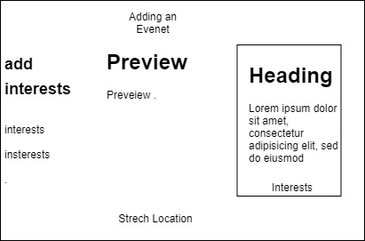
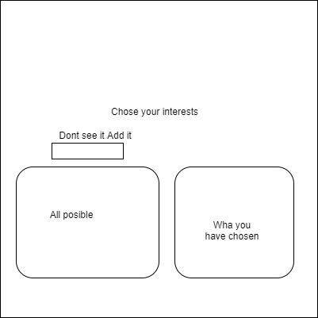
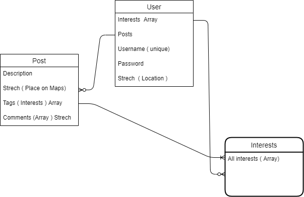

https://interests-ivo-final.herokuapp.com/

Interests is a fun and light app that will allow you to find events near you,
sutted to your personal taste, also organize events and meetings that will show
to a specific people interested in those tags, also the hose is able to delete the posts
and pick the location of the event, as well as being able to see how many people will join
the event .The database is made in a way
that every user can contribute to it and help it grow,

A list of the technologies used.:
Node , Express, Ejs , Mongoose , MongoDB , Leafletjs, , Bycript , Express-session , Dotenv, Nodemon.

The app has an easy installation you go the the https://git.generalassemb.ly/ivoka/Final
then clone it on yout local machine and run 'npm i' this will install all the dependencies,
also make sure that you have a working MongooseDB , after those steps have been completed
go to your localhost port 4000 and enjoy.

This application is made for everyone who is looking forward
to post or join an existing event and meet with new people,
and have fun.

Login page

Create page

All the posts 

Adding and removing interests

Database connections

the app can be updated by adding comments to each post that will allow users to communicate.

